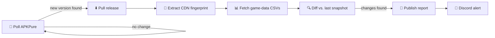

# ⛏️ Clash of Clans Datamine

**Automated, unfiltered patch notes — pulled straight from Supercell's asset CDN the moment a new build ships.**

---

No teasers, no marketing copy — just the numbers Supercell actually shipped. A Discord bot watches for new Clash of Clans releases, pulls the raw game-data files out of each one, and diffs them against the last known snapshot. What comes out is checked into [`reports/`](reports/): every new unit, every level added, every stat nudged up or down.

## How it works

The bot checks for a new release on a fixed interval. When one appears, it pulls the game's asset fingerprint, fetches every tracked data category from Supercell's CDN, and diffs the new snapshot against the previous one. Anything that changed gets written here as a self-contained markdown report and pinged out to Discord.

## What gets tracked

<table>
<tr><td valign="top">

**Home Village**
- ⚔️ Troops
- 🦸 Heroes
- 🐾 Pets
- 🔮 Spells
- 🛡️ Equipment
- 🏛️ Buildings
- 🎨 Skins
- 💣 Traps
- 🏆 Achievements
- 🌳 Decorations
- 🏰 Town Hall levels

</td><td valign="top">

**Clan Capital**
- 🗿 Troops
- 🏯 Buildings
- 🌆 Decorations
- 🗺️ Districts
- 🪨 Obstacles
- 💥 Spells
- 🧨 Traps

</td><td valign="top">

**Leagues & Progression**
- 🎖️ Leagues
- 🥈 Leagues (Versus)
- 🏅 War Leagues
- 🎗️ League Tiers
- 🏳️ Alliance Badges
- 🎫 Pass Tasks
- 📦 Collection Items

</td></tr>
</table>

26 categories in total, each diffed independently every run.

## Reading a report

Every file in [`reports/`](reports/) is named `YYYY-MM-DD_<fingerprint>.md` and opens with a scoreboard:

| New units | Balance changes | Bulk rollouts |
|---|---|---|
| 0 | 50 | 2 |

Below that, one section per category that actually changed — new units with their headline stats, level-by-level stat tables, and **bulk rollouts**: the same exact value swap applied across dozens of entries at once, which usually means a global mechanic change rather than individual balance tuning. Nothing is truncated; this is the full diff, not a highlight reel.

## Why this exists

Clash of Clans patch notes are often vague or delayed. The raw game-data CSVs Supercell ships in every build aren't — they're the literal numbers the client runs on. This repo just makes them visible, automatically, the moment they change.

---

*Fan-made and unofficial. Not affiliated with, endorsed by, or associated with Supercell.*

