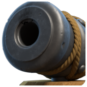
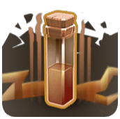

# ⛏️ Clash of Clans Datamine Report

**Fingerprint:** `11e16c188447c4128ddd4bce9ca4c9ac38f305be`  
**Generated:** 2026-07-26 03:43 UTC

| New units | Balance changes | Bulk rollouts |
|---|---|---|
| 12 | 68 | 28 |

---

## ⚔️ Troops _(6 new, 28 changed, 14 bulk)_

**🆕 New units**

-  **Ruin Witch**
-  **Ruin Knight**
-  **Elephant**
-  **Rider**
-  **Elephant Rider**
-  **Ruin Witch_DEF**

**⬆️ New levels**

| Unit | New levels |
|---|---|
| **Defending Builder** | 7 |

**📊 Changed**

| Unit | Level | Field | Old → New |
|---|---|---|---|
| Dragon Rider | 6 | Hitpoints | 6200 → 6000 |
| Dragon Rider | 6 | DPS | 520 → 510 |
| Prototype4 | 1 | StrengthWeight | 2000 → 12000 |
| Prototype5 | 1 | StrengthWeight | 2000 → 12000 |
| Prototype6 | 1 | StrengthWeight | 2000 → 12000 |
| Prototype7 | 1 | StrengthWeight | 2000 → 12000 |
| Air Troop Launcher | 1 | AttackCount | 5 → 4 |
| Air Troop Launcher | 2 | AttackCount | 5 → 4 |
| Air Troop Launcher | 3 | AttackCount | 6 → 5 |
| Air Troop Launcher | 4 | AttackCount | 6 → 5 |
| UnusedSiegePrototype | 1 | AttackCount | 6 → 5 |
| Unused8 | 1 | AttackCount | 6 → 5 |
| Unused9 | 1 | AttackCount | 6 → 5 |
| Air Troop Launcher | 1 | NewTargetAttackDelay | 400 → 600 |
| Air Troop Launcher | 2 | NewTargetAttackDelay | 400 → 600 |
| Air Troop Launcher | 3 | NewTargetAttackDelay | 400 → 600 |
| Air Troop Launcher | 4 | NewTargetAttackDelay | 400 → 600 |
| UnusedSiegePrototype | 1 | NewTargetAttackDelay | 400 → 600 |
| Unused8 | 1 | NewTargetAttackDelay | 400 → 600 |
| Unused9 | 1 | NewTargetAttackDelay | 400 → 600 |
| Air Troop Launcher | 1 | UnlockByTH | 6 → 1 |
| Air Troop Launcher | 2 | UnlockByTH | 6 → 1 |
| Air Troop Launcher | 3 | UnlockByTH | 6 → 1 |
| Air Troop Launcher | 4 | UnlockByTH | 6 → 1 |
| UnusedSiegePrototype | 1 | UnlockByTH | 6 → 1 |
| Unused8 | 1 | UnlockByTH | 6 → 1 |
| Unused9 | 1 | UnlockByTH | 6 → 1 |

**🗑️ Removed**

- Artificer
- Debris Golem
- Unused5
- Unused6
- Unused7

**🔧 Bulk changes** _(same field changed on many entries at once)_

| Field | Entries affected |
|---|---|
| UpgradeTimeH | 21 |
| SecondarySpawnDist | 154 |
| SummonTime | 154 |
| SummonCooldown | 154 |
| SummonLimit | 154 |
| SummonLevel | 154 |
| SummonDelay | 246 |
| ConsumeDebrisOnSummon | 246 |
| DebrisSummonCompletionTime | 246 |
| DiesWhenSpawnLimitReached | 246 |
| SummonLifetimeLimit | 246 |
| LoseHpPerTick | 209 |
| DamageMultiplierPercent | 242 |
| HealerWeight | 162 |

## 🦸 Heroes _(0 new, 9 changed, 1 bulk)_

**⬆️ New levels**

| Unit | New levels |
|---|---|
| **Barbarian King** | 106→110 (5) |
| **Archer Queen** | 106→110 (5) |
| **Grand Warden** | 81→85 (5) |

**📊 Changed**

| Unit | Level | Field | Old → New |
|---|---|---|---|
| Barbarian King | 1 | RequiredTownHallLevel | 7 → 4 |
| Barbarian King | 105 | UpgradeCost | 450000 → 460000 |
| Archer Queen | 105 | UpgradeCost | 450000 → 460000 |
| Grand Warden | 78 | UpgradeCost | 28500000 → 27500000 |
| Grand Warden | 79 | UpgradeCost | 30000000 → 28000000 |
| Grand Warden | 80 | UpgradeCost | 30000000 → 28500000 |

**🔧 Bulk changes** _(same field changed on many entries at once)_

| Field | Entries affected |
|---|---|
| ScaleByTH | 521 |

## 🔮 Spells _(4 new, 17 changed, 7 bulk)_

**🆕 New units**

-  **AngrySpell**
-  **ElephantRiderSummonElephant**
-  **ElephantRiderSummonRider**
-  **CakeThrowerExplosion**

**📊 Changed**

| Unit | Level | Field | Old → New |
|---|---|---|---|
| Spell Tower Rage | 1 | Radius | 501 → 500 |
| Unused4 | 1 | Damage | 150 → 0 |
| Unused5 | 1 | Damage | 150 → 0 |
| Lava Launcher Hit Spell_Seasonal_Defense | 1 | Damage | 26 → 21 |
| Lava Launcher Hit Spell_Seasonal_Defense | 2 | Damage | 27 → 22 |
| Lava Launcher Hit Spell_Seasonal_Defense | 3 | Damage | 29 → 23 |
| Lava Launcher Hit Spell_Seasonal_Defense | 4 | Damage | 30 → 24 |
| Lava Launcher Hit Spell_Seasonal_Defense | 5 | Damage | 31 → 25 |
| Lava Launcher Hit Spell_Seasonal_Defense | 6 | Damage | 33 → 26 |
| Lava Launcher Hit Spell_Seasonal_Defense | 7 | Damage | 34 → 27 |
| Lava Launcher Hit Spell_Seasonal_Defense | 8 | Damage | 36 → 29 |
| Lava Launcher Hit Spell_Seasonal_Defense | 9 | Damage | 38 → 30 |
| Lava Launcher Hit Spell_Seasonal_Defense | 10 | Damage | 40 → 32 |
| Spell Tower Earthquake | 1 | Damage | 40 → 32 |
| Unused9 | 1 | Damage | 500 → 0 |
| Unused4 | 1 | StrengthWeight | 700 → 2300 |
| Unused5 | 1 | StrengthWeight | 700 → 2300 |

**🗑️ Removed**

- Unused10
- Unused6
- Unused7
- Unused8

**🔧 Bulk changes** _(same field changed on many entries at once)_

| Field | Entries affected |
|---|---|
| SpellForgeLevel | 106 |
| LaboratoryLevel | 106 |
| UpgradeTimeH | 106 |
| UpgradeResource | 106 |
| UpgradeCost | 106 |
| StunTimeMS | 92 |
| GivenSpecialAbilityLevel | 106 |

## 🛡️ Equipment _(1 new, 0 changed, 1 bulk)_

**🆕 New units**

-  **Draconic Counter**

**🔧 Bulk changes** _(same field changed on many entries at once)_

| Field | Entries affected |
|---|---|
| DPS | 17 |

## 🏛️ Buildings _(1 new, 14 changed, 5 bulk)_

**🆕 New units**

- **BB Builders Hut**

**⬆️ New levels**

| Unit | New levels |
|---|---|
| **Dark Barracks** | 13 |
| **Dark Spell Factory** | 8 |
| **Builders Hut** | 8 |
| **Monolith** | 5 |

**📊 Changed**

| Unit | Level | Field | Old → New |
|---|---|---|---|
| Hero Hall | 1 | BuildTimeD | 1 → 0 |
| Hero Hall | 1 | BuildTimeH | 0 → 1 |
| Hero Hall | 1 | BuildCost | 800000 → 30000 |
| Hero Hall | 1 | TownHallLevel | 7 → 4 |
| Hero Hall | 1 | CapitalHallLevel | 7 → 4 |
| Hero Hall | 1 | Hitpoints | 2000 → 800 |
| Hero Hall | 2 | Hitpoints | 2400 → 1600 |
| Hero Hall | 3 | Hitpoints | 2800 → 2400 |
| BOBs Hut | 1 | StrengthWeight | 8500 → 9000 |
| Helper Hut | 1 | StrengthWeight | 8500 → 9000 |

**🗑️ Removed**

- BB UNUSED

**🔧 Bulk changes** _(same field changed on many entries at once)_

| Field | Entries affected |
|---|---|
| EarlyExportNameMaxTownHall | 551 |
| DPS | 25 |
| DefenceTroopLevel | 230 |
| AmountCanBeUpgraded | 490 |
| DamagePermilHp | 312 |
