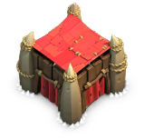

# ⛏️ Clash of Clans Datamine Report

**Fingerprint:** `95c0ae5e9529ccc4ac4c2a55c9c71647a2394430`  
**Generated:** 2026-08-31 12:21 UTC

| New units | Balance changes | Bulk rollouts |
|---|---|---|
| 65 | 337 | 9 |

---

## ⚔️ Troops _(4 new, 66 changed, 1 bulk)_

**🆕 New units**

- **Undead Wrestler Big Boy** — _HousingSpace 20 • Hitpoints 400 • DPS 45 • Speed 150 • AttackRange 100_
-  **UndeadWrestler** — _HousingSpace 80 • Hitpoints 500 • DPS 150 • Speed 300 • AttackRange 80 • UnlockByTH 4_
- **Tiny Totem** — _HousingSpace 20 • Hitpoints 3840 • DPS 1 • Speed 0 • AttackRange 1_
-  **Totem Thrower** — _HousingSpace 28 • Hitpoints 2040 • DPS 204 • Speed 270 • AttackRange 600 • UnlockByTH 1_

**📊 Changed**

| Unit | Level | Field | Old → New |
|---|---|---|---|
| Giant Giant | 1 | UnlockByTH | 6 → 3 |
| Giant Giant | 2 | UnlockByTH | 6 → 3 |
| Giant Giant | 3 | UnlockByTH | 6 → 3 |
| Giant Giant | 4 | UnlockByTH | 6 → 3 |
| Giant Giant | 5 | UnlockByTH | 6 → 3 |
| Giant Giant | 6 | UnlockByTH | 6 → 3 |
| Giant Giant | 7 | UnlockByTH | 6 → 3 |
| Giant Giant | 8 | UnlockByTH | 6 → 3 |
| Giant Giant | 9 | UnlockByTH | 6 → 3 |
| Giant Giant | 10 | UnlockByTH | 6 → 3 |
| Giant Giant | 11 | UnlockByTH | 6 → 3 |
| Giant Giant | 12 | UnlockByTH | 6 → 3 |
| Giant Giant | 13 | UnlockByTH | 6 → 3 |
| Giant Giant | 14 | UnlockByTH | 6 → 3 |
| Giant Giant | 15 | UnlockByTH | 6 → 3 |
| Giant Giant | 16 | UnlockByTH | 6 → 3 |
| KANE | 1 | UnlockByTH | 6 → 4 |
| KANE | 2 | UnlockByTH | 6 → 4 |
| KANE | 3 | UnlockByTH | 6 → 4 |
| KANE | 4 | UnlockByTH | 6 → 4 |
| KANE | 5 | UnlockByTH | 6 → 4 |
| KANE | 6 | UnlockByTH | 6 → 4 |
| KANE | 7 | UnlockByTH | 6 → 4 |
| KANE | 8 | UnlockByTH | 6 → 4 |
| KANE | 9 | UnlockByTH | 6 → 4 |
| KANE | 10 | UnlockByTH | 6 → 4 |
| KANE | 11 | UnlockByTH | 6 → 4 |
| KANE | 12 | UnlockByTH | 6 → 4 |
| KANE | 13 | UnlockByTH | 6 → 4 |
| KANE | 14 | UnlockByTH | 6 → 4 |
| KANE | 15 | UnlockByTH | 6 → 4 |
| KANE | 16 | UnlockByTH | 6 → 4 |
| Totem | 1 | HousingSpace | 20 → 1 |
| Totem | 2 | HousingSpace | 20 → 1 |
| Totem | 3 | HousingSpace | 20 → 1 |
| Totem | 4 | HousingSpace | 20 → 1 |
| Ruin Witch | 1 | SummonLimit | 8 → 10 |
| Ruin Witch | 2 | SummonLimit | 8 → 10 |
| Ruin Witch | 3 | SummonLimit | 8 → 10 |
| Ruin Witch | 4 | SummonLimit | 8 → 10 |
| Ruin Witch | 1 | SummonLifetimeLimit | 8 → 10 |
| Ruin Witch | 2 | SummonLifetimeLimit | 8 → 10 |
| Ruin Witch | 3 | SummonLifetimeLimit | 8 → 10 |
| Ruin Witch | 4 | SummonLifetimeLimit | 8 → 10 |
| Ruin Knight | 1 | LoseHpPerTick | 40 → None |
| Ruin Knight | 2 | LoseHpPerTick | 40 → None |
| Ruin Knight | 3 | LoseHpPerTick | 40 → None |
| Ruin Knight | 4 | LoseHpPerTick | 40 → None |
| Ruin Knight | 1 | LoseHpInterval | 500 → None |
| Ruin Knight | 2 | LoseHpInterval | 500 → None |
| Ruin Knight | 3 | LoseHpInterval | 500 → None |
| Ruin Knight | 4 | LoseHpInterval | 500 → None |
| Unused2 | 1 | Hitpoints | 45 → 46 |
| DEPRECATED | 1 | StrengthWeight | None → 0 |
| DEPRECATED | 2 | StrengthWeight | None → 0 |
| DEPRECATED | 3 | StrengthWeight | None → 0 |
| DEPRECATED | 4 | StrengthWeight | None → 0 |
| DEPRECATED | 5 | StrengthWeight | None → 0 |
| DEPRECATED | 6 | StrengthWeight | None → 0 |
| DEPRECATED | 7 | StrengthWeight | None → 0 |
| DEPRECATED | 8 | StrengthWeight | None → 0 |
| DEPRECATED | 9 | StrengthWeight | None → 0 |
| DEPRECATED | 10 | StrengthWeight | None → 0 |
| BB Raged Barbarian | 1 | UpgradeTimeH | None → 0 |
| BB Raged Barbarian | 1 | UpgradeTimeM | None → 0 |
| BB MovingCannonSecondary | 1 | DamageRadius | None → 0 |

**🗑️ Removed**

- Unused8
- Unused9

**🔧 Bulk changes** _(the exact same value swap repeated across many entries at once — a global mechanic/constant change, not individual tuning)_

| Field | Old → New | Units affected | Entries |
|---|---|---|---|
| InheritSpecialAbilities | None → True | 4 | 32 |

## 🐾 Pets _(0 new, 8 changed, 0 bulk)_

**⬆️ New levels**

| Unit | New levels |
|---|---|
| **Diggy** | 11→15 (5) |

**📊 Changed**

| Unit | Level | Field | Old → New |
|---|---|---|---|
| Diggy | 6 | StrengthWeight | 20000 → 19500 |
| Diggy | 7 | StrengthWeight | 21000 → 20000 |
| Diggy | 8 | StrengthWeight | 22000 → 20500 |
| Diggy | 9 | StrengthWeight | 23000 → 21000 |
| Diggy | 10 | UpgradeTimeH | 156 → 168 |
| Diggy | 10 | UpgradeCost | 180000 → 220000 |
| Diggy | 10 | StrengthWeight | 24000 → 21500 |

## 🔮 Spells _(6 new, 1 changed, 0 bulk)_

**🆕 New units**

- **UndeadWrestlerDeathSpawn** — _Damage 0 • Radius 300_
- **TinyTotemImpact** — _DeployTimeMS 0 • Damage 0 • Radius 500_
- **TinyTotemSummon** — _DeployTimeMS 100 • Damage 0 • Radius 0_
- **CakeThrowerExplosion2** — _DeployTimeMS 1999 • Damage 400 • Radius 250_
- **CakeThrowerExplosion3** — _DeployTimeMS 1999 • Damage 400 • Radius 250_
- **CakeThrowerExplosion4** — _DeployTimeMS 1999 • Damage 400 • Radius 250_

**📊 Changed**

| Unit | Level | Field | Old → New |
|---|---|---|---|
| AngrySpell | 1 | LaboratoryLevel | 13 → 1 |

**🗑️ Removed**

- Unused9

## 🛡️ Equipment _(1 new, 0 changed, 0 bulk)_

**🆕 New units**

-  **Cosmic Portal** — _Rarity EPIC • HealOnActivation 558 • RequiredBlacksmithLevel 1_

## 🏛️ Buildings _(1 new, 105 changed, 5 bulk)_

**🆕 New units**

-  **PEKKAs Playhouse** — _Hitpoints 15000 • TownHallLevel 1 • BuildCost 250_

**📊 Changed**

| Unit | Level | Field | Old → New |
|---|---|---|---|
| Town Hall | 1 | AreEdgesUnpassableByVillagers | None → True |
| Town Hall | 2 | AreEdgesUnpassableByVillagers | None → True |
| Town Hall | 3 | AreEdgesUnpassableByVillagers | None → True |
| Town Hall | 4 | AreEdgesUnpassableByVillagers | None → True |
| Town Hall | 5 | AreEdgesUnpassableByVillagers | None → True |
| Town Hall | 6 | AreEdgesUnpassableByVillagers | None → True |
| Town Hall | 7 | AreEdgesUnpassableByVillagers | None → True |
| Town Hall | 8 | AreEdgesUnpassableByVillagers | None → True |
| Town Hall | 9 | AreEdgesUnpassableByVillagers | None → True |
| Town Hall | 10 | AreEdgesUnpassableByVillagers | None → True |
| Town Hall | 11 | AreEdgesUnpassableByVillagers | None → True |
| Town Hall | 12 | AreEdgesUnpassableByVillagers | None → True |
| Town Hall | 13 | AreEdgesUnpassableByVillagers | None → True |
| Town Hall | 14 | AreEdgesUnpassableByVillagers | None → True |
| Town Hall | 15 | AreEdgesUnpassableByVillagers | None → True |
| Town Hall | 16 | AreEdgesUnpassableByVillagers | None → True |
| Town Hall | 17 | AreEdgesUnpassableByVillagers | None → True |
| Town Hall | 1 | MaxStoredDarkElixir | None → 0 |
| Town Hall | 2 | MaxStoredDarkElixir | None → 0 |
| Town Hall | 3 | MaxStoredDarkElixir | None → 0 |
| Town Hall | 4 | MaxStoredDarkElixir | None → 0 |
| Town Hall | 5 | MaxStoredDarkElixir | None → 0 |
| Town Hall | 6 | MaxStoredDarkElixir | None → 0 |
| Goblin Hall | 1 | MaxStoredDarkElixir | None → 0 |
| Town Hall | 1 | PercentageStoredDarkElixir | None → 0 |
| Town Hall | 2 | PercentageStoredDarkElixir | None → 0 |
| Town Hall | 3 | PercentageStoredDarkElixir | None → 0 |
| Town Hall | 4 | PercentageStoredDarkElixir | None → 0 |
| Town Hall | 5 | PercentageStoredDarkElixir | None → 0 |
| Town Hall | 6 | PercentageStoredDarkElixir | None → 0 |
| Goblin Hall | 1 | PercentageStoredDarkElixir | None → 0 |
| Town Hall | 1 | DefenderZ | None → 0 |
| Town Hall | 2 | DefenderZ | None → 0 |
| Town Hall | 3 | DefenderZ | None → 0 |
| Town Hall | 4 | DefenderZ | None → 0 |
| Town Hall | 5 | DefenderZ | None → 0 |
| Town Hall | 6 | DefenderZ | None → 0 |
| Town Hall | 7 | DefenderZ | None → 0 |
| Town Hall | 8 | DefenderZ | None → 0 |
| Town Hall | 9 | DefenderZ | None → 0 |
| Town Hall | 10 | DefenderZ | None → 0 |
| Town Hall | 11 | DefenderZ | None → 0 |
| Town Hall | 12 | DefenderZ | None → 0 |
| Town Hall | 13 | DefenderZ | None → 0 |
| Town Hall | 14 | DefenderZ | None → 0 |
| Town Hall | 15 | DefenderZ | None → 0 |
| Town Hall | 16 | DefenderZ | None → 0 |
| Town Hall | 17 | DefenderZ | None → 0 |
| Town Hall | 1 | HousesGuardians | None → True |
| Town Hall | 2 | HousesGuardians | None → True |
| Town Hall | 3 | HousesGuardians | None → True |
| Town Hall | 4 | HousesGuardians | None → True |
| Town Hall | 5 | HousesGuardians | None → True |
| Town Hall | 6 | HousesGuardians | None → True |
| Town Hall | 7 | HousesGuardians | None → True |
| Town Hall | 8 | HousesGuardians | None → True |
| Town Hall | 9 | HousesGuardians | None → True |
| Town Hall | 10 | HousesGuardians | None → True |
| Town Hall | 11 | HousesGuardians | None → True |
| Town Hall | 12 | HousesGuardians | None → True |
| Town Hall | 13 | HousesGuardians | None → True |
| Town Hall | 14 | HousesGuardians | None → True |
| Town Hall | 15 | HousesGuardians | None → True |
| Town Hall | 16 | HousesGuardians | None → True |
| Town Hall | 17 | HousesGuardians | None → True |
| Town Hall | 1 | ActivateAfterSeconds | None → 0 |
| Town Hall | 2 | ActivateAfterSeconds | None → 0 |
| Town Hall | 3 | ActivateAfterSeconds | None → 0 |
| Town Hall | 4 | ActivateAfterSeconds | None → 0 |
| Town Hall | 5 | ActivateAfterSeconds | None → 0 |
| Town Hall | 6 | ActivateAfterSeconds | None → 0 |
| Town Hall | 7 | ActivateAfterSeconds | None → 0 |
| Town Hall | 8 | ActivateAfterSeconds | None → 0 |
| Town Hall | 9 | ActivateAfterSeconds | None → 0 |
| Town Hall | 10 | ActivateAfterSeconds | None → 0 |
| Town Hall | 11 | ActivateAfterSeconds | None → 0 |
| Town Hall | 12 | ActivateAfterSeconds | None → 0 |
| Town Hall | 13 | ActivateAfterSeconds | None → 0 |
| Town Hall | 14 | ActivateAfterSeconds | None → 0 |
| Town Hall | 15 | ActivateAfterSeconds | None → 0 |
| Town Hall | 16 | ActivateAfterSeconds | None → 0 |
| Builders Hut | 1 | DPS | None → 0 |
| Goblin Hall | 1 | DPS | None → 0 |
| Builders Hut | 1 | WakeUpSpace | None → 0 |
| Builders Hut | 1 | DefenceTroopCount | None → 0 |
| Builders Hut | 1 | DefenceTroopLevel | None → 0 |
| Wall | 1 | UseCustomCornerPiecesInTJunctions | None → True |
| Wall | 2 | UseCustomCornerPiecesInTJunctions | None → True |
| Wall | 3 | UseCustomCornerPiecesInTJunctions | None → True |
| Wall | 4 | UseCustomCornerPiecesInTJunctions | None → True |
| Wall | 5 | UseCustomCornerPiecesInTJunctions | None → True |
| Wall | 6 | UseCustomCornerPiecesInTJunctions | None → True |
| Wall | 7 | UseCustomCornerPiecesInTJunctions | None → True |
| Wall | 8 | UseCustomCornerPiecesInTJunctions | None → True |
| Wall | 9 | UseCustomCornerPiecesInTJunctions | None → True |
| Wall | 10 | UseCustomCornerPiecesInTJunctions | None → True |
| Wall | 11 | UseCustomCornerPiecesInTJunctions | None → True |
| Wall | 12 | UseCustomCornerPiecesInTJunctions | None → True |
| Wall | 13 | UseCustomCornerPiecesInTJunctions | None → True |
| Wall | 14 | UseCustomCornerPiecesInTJunctions | None → True |
| Wall | 15 | UseCustomCornerPiecesInTJunctions | None → True |
| Wall | 16 | UseCustomCornerPiecesInTJunctions | None → True |
| Goblin Hall | 1 | AttackRange | None → 0 |
| Goblin Hall | 1 | AttackSpeed | None → 0 |
| BB BOB Control | 1 | UpgradeTasksRequired | None → 0 |

**🗑️ Removed**

- PEKKA's Playhouse

**🔧 Bulk changes** _(the exact same value swap repeated across many entries at once — a global mechanic/constant change, not individual tuning)_

| Field | Old → New | Units affected | Entries |
|---|---|---|---|
| ActivateCombatOnDamageTaken | None → 0 | 2 | 12 |
| CombatActivationDelay | None → 0 | 2 | 12 |
| BoostCost | None → 0 | 3 | 11 |
| GearUpCost | None → 0 | 3 | 22 |
| GearUpTime | None → 0 | 3 | 22 |

## 🎨 Skins _(53 new, 155 changed, 3 bulk)_

**🆕 New units**

- **LeaguePrince** — _Character Minion Prince • Tier LEGENDARY • ReleaseMonth 2026-07 • ThemeYear 0_
-  **UndeadWrestler** — _Character UndeadWrestler • Tier DEFAULT • ThemeYear 0_
- **UndeadGiantSkeleton** — _Character Undead Wrestler Big Boy • Tier DEFAULT • ThemeYear 0_
- **ArcherQueen071** — _Character Archer Queen • ThemeYear 0_
- **ArcherQueen072** — _Character Archer Queen • ThemeYear 0_
- **ArcherQueen073** — _Character Archer Queen • ThemeYear 0_
- **ArcherQueen074** — _Character Archer Queen • ThemeYear 0_
- **ArcherQueen075** — _Character Archer Queen • ThemeYear 0_
- **ArcherQueen076** — _Character Archer Queen • ThemeYear 0_
- **ArcherQueen077** — _Character Archer Queen • ThemeYear 0_
- **ArcherQueen078** — _Character Archer Queen • ThemeYear 0_
- **ArcherQueen079** — _Character Archer Queen • ThemeYear 0_
- **ArcherQueen080** — _Character Archer Queen • ThemeYear 0_
- **GrandWarden061** — _Character Grand Warden • ThemeYear 0_
- **GrandWarden062** — _Character Grand Warden • ThemeYear 0_
- **GrandWarden063** — _Character Grand Warden • ThemeYear 0_
- **GrandWarden064** — _Character Grand Warden • ThemeYear 0_
- **GrandWarden065** — _Character Grand Warden • ThemeYear 0_
- **GrandWarden066** — _Character Grand Warden • ThemeYear 0_
- **GrandWarden067** — _Character Grand Warden • ThemeYear 0_
- **GrandWarden068** — _Character Grand Warden • ThemeYear 0_
- **GrandWarden069** — _Character Grand Warden • ThemeYear 0_
- **GrandWarden070** — _Character Grand Warden • ThemeYear 0_
- **BarbarianKing081** — _Character Barbarian King • ThemeYear 0_
- **BarbarianKing082** — _Character Barbarian King • ThemeYear 0_
- **BarbarianKing083** — _Character Barbarian King • ThemeYear 0_
- **BarbarianKing084** — _Character Barbarian King • ThemeYear 0_
- **BarbarianKing085** — _Character Barbarian King • ThemeYear 0_
- **BarbarianKing086** — _Character Barbarian King • ThemeYear 0_
- **BarbarianKing087** — _Character Barbarian King • ThemeYear 0_
- **BarbarianKing088** — _Character Barbarian King • ThemeYear 0_
- **BarbarianKing089** — _Character Barbarian King • ThemeYear 0_
- **BarbarianKing090** — _Character Barbarian King • ThemeYear 0_
- **MinionHero031** — _Character Minion Prince • ThemeYear 0_
- **MinionHero032** — _Character Minion Prince • ThemeYear 0_
- **MinionHero033** — _Character Minion Prince • ThemeYear 0_
- **MinionHero034** — _Character Minion Prince • ThemeYear 0_
- **MinionHero035** — _Character Minion Prince • ThemeYear 0_
- **MinionHero036** — _Character Minion Prince • ThemeYear 0_
- **MinionHero037** — _Character Minion Prince • ThemeYear 0_
- **MinionHero038** — _Character Minion Prince • ThemeYear 0_
- **MinionHero039** — _Character Minion Prince • ThemeYear 0_
- **MinionHero040** — _Character Minion Prince • ThemeYear 0_
- **RoyalChampion061** — _Character Royal Champion • ThemeYear 0_
- **RoyalChampion062** — _Character Royal Champion • ThemeYear 0_
- **RoyalChampion063** — _Character Royal Champion • ThemeYear 0_
- **RoyalChampion064** — _Character Royal Champion • ThemeYear 0_
- **RoyalChampion065** — _Character Royal Champion • ThemeYear 0_
- **RoyalChampion066** — _Character Royal Champion • ThemeYear 0_
- **RoyalChampion067** — _Character Royal Champion • ThemeYear 0_
- **RoyalChampion068** — _Character Royal Champion • ThemeYear 0_
- **RoyalChampion069** — _Character Royal Champion • ThemeYear 0_
- **RoyalChampion070** — _Character Royal Champion • ThemeYear 0_

**⬆️ New levels**

| Unit | New levels |
|---|---|
| **BarbarianKing069** | 2→4 (3) |
| **ArcherQueen063** | 2→4 (3) |
| **GrandWarden055** | 2→4 (3) |
| **RoyalChampion051** | 2→4 (3) |

**📊 Changed**

| Unit | Level | Field | Old → New |
|---|---|---|---|
| GrandWarden050 | 1 | PortraitCameraInfoScreenAltitudeChange | -100 → -150 |
| MinionHero019 | 1 | PortraitCameraFov | 30 → 28 |
| MinionHero019 | 1 | PortraitCameraDefaultModelRotation | 55 → 30 |
| MinionHero019 | 1 | PortraitCameraArmyScreenFovAdd | 7 → 4 |
| MinionHero019 | 1 | PortraitCameraInfoScreenFovAdd | 7 → 8 |
| DragonDuke006 | 1 | PortraitCameraInfoScreenFovAdd | 7 → 8 |
| MinionHero019 | 1 | BloomStrength | 0 → 20 |
| BarbarianKing067 | 1 | BloomStrength | 0 → 20 |
| BarbarianKing069 | 1 | BloomStrength | 0 → 20 |
| BarbarianKing070 | 1 | BloomStrength | 0 → 20 |
| GrandWarden055 | 1 | BloomStrength | 0 → 20 |
| DragonDuke006 | 1 | BloomStrength | 0 → 20 |
| DragonDuke008 | 1 | BloomStrength | 0 → 20 |
| MinionHero021 | 1 | BloomStrength | 0 → 20 |
| RoyalChampion051 | 1 | BloomStrength | 0 → 20 |
| MinionHero019 | 1 | BloomThreshold | 0 → 90 |
| BarbarianKing067 | 1 | BloomThreshold | 0 → 90 |
| BarbarianKing070 | 1 | BloomThreshold | 0 → 90 |
| RoyalChampion047 | 1 | BloomThreshold | 0 → 90 |
| RoyalChampion049 | 1 | BloomThreshold | 0 → 90 |
| GrandWarden052 | 1 | BloomThreshold | 0 → 90 |
| GrandWarden056 | 1 | BloomThreshold | 0 → 90 |
| MinionHero021 | 1 | BloomThreshold | 0 → 90 |
| RoyalChampion052 | 1 | BloomThreshold | 0 → 90 |
| BarbarianKing067 | 1 | PortraitCameraDefaultModelRotation | 55 → 45 |
| BarbarianKing070 | 1 | PortraitCameraDefaultModelRotation | 55 → 45 |
| RoyalChampion049 | 1 | PortraitCameraDefaultModelRotation | 55 → 45 |
| DragonDuke006 | 1 | PortraitCameraDefaultModelRotation | 55 → 45 |
| DragonDuke008 | 1 | PortraitCameraDefaultModelRotation | 55 → 45 |
| MinionHero021 | 1 | PortraitCameraDefaultModelRotation | 55 → 45 |
| BarbarianKing067 | 1 | PortraitCameraArmyScreenFovAdd | 7 → 10 |
| BarbarianKing067 | 1 | PortraitCameraArmyScreenAltitudeChange | -200 → -350 |
| GrandWarden056 | 1 | PortraitCameraArmyScreenAltitudeChange | -200 → -350 |
| BarbarianKing067 | 1 | PortraitCameraInfoScreenFovAdd | 7 → 13 |
| BarbarianKing067 | 1 | PortraitCameraInfoScreenAltitudeChange | -200 → -300 |
| ArcherQueen061 | 1 | PortraitCameraInfoScreenAltitudeChange | -200 → -300 |
| BarbarianKing069 | 1 | CameraDistance | 0 → 10500 |
| BarbarianKing069 | 1 | PortraitCameraFov | 30 → None |
| ArcherQueen063 | 1 | PortraitCameraFov | 30 → None |
| GrandWarden055 | 1 | PortraitCameraFov | 30 → None |
| RoyalChampion051 | 1 | PortraitCameraFov | 30 → None |
| BarbarianKing069 | 1 | PortraitCameraDefaultModelRotation | 55 → None |
| ArcherQueen063 | 1 | PortraitCameraDefaultModelRotation | 55 → None |
| GrandWarden055 | 1 | PortraitCameraDefaultModelRotation | 55 → None |
| RoyalChampion051 | 1 | PortraitCameraDefaultModelRotation | 55 → None |
| BarbarianKing069 | 1 | PortraitCameraArmyScreenFovAdd | 7 → None |
| ArcherQueen063 | 1 | PortraitCameraArmyScreenFovAdd | 7 → None |
| GrandWarden055 | 1 | PortraitCameraArmyScreenFovAdd | 7 → None |
| RoyalChampion051 | 1 | PortraitCameraArmyScreenFovAdd | 7 → None |
| BarbarianKing069 | 1 | PortraitCameraArmyScreenAltitudeChange | -200 → None |
| ArcherQueen063 | 1 | PortraitCameraArmyScreenAltitudeChange | -200 → None |
| GrandWarden055 | 1 | PortraitCameraArmyScreenAltitudeChange | -200 → None |
| RoyalChampion051 | 1 | PortraitCameraArmyScreenAltitudeChange | -200 → None |
| BarbarianKing069 | 1 | PortraitCameraInfoScreenFovAdd | 7 → None |
| ArcherQueen063 | 1 | PortraitCameraInfoScreenFovAdd | 7 → None |
| GrandWarden055 | 1 | PortraitCameraInfoScreenFovAdd | 7 → None |
| RoyalChampion051 | 1 | PortraitCameraInfoScreenFovAdd | 7 → None |
| BarbarianKing069 | 1 | PortraitCameraInfoScreenAltitudeChange | -200 → None |
| ArcherQueen063 | 1 | PortraitCameraInfoScreenAltitudeChange | -200 → None |
| GrandWarden055 | 1 | PortraitCameraInfoScreenAltitudeChange | -200 → None |
| RoyalChampion051 | 1 | PortraitCameraInfoScreenAltitudeChange | -200 → None |
| BarbarianKing069 | 1 | UseMenuPoseInPortrait | True → None |
| ArcherQueen063 | 1 | UseMenuPoseInPortrait | True → None |
| GrandWarden055 | 1 | UseMenuPoseInPortrait | True → None |
| RoyalChampion051 | 1 | UseMenuPoseInPortrait | True → None |
| BarbarianKing069 | 1 | BloomThreshold | 0 → 100 |
| GrandWarden055 | 1 | BloomThreshold | 0 → 100 |
| DragonDuke006 | 1 | BloomThreshold | 0 → 100 |
| DragonDuke008 | 1 | BloomThreshold | 0 → 100 |
| RoyalChampion051 | 1 | BloomThreshold | 0 → 100 |
| BarbarianKing069 | 1 | RewardTrackCameraDefaultModelRotation | 45 → None |
| ArcherQueen063 | 1 | RewardTrackCameraDefaultModelRotation | 45 → None |
| GrandWarden055 | 1 | RewardTrackCameraDefaultModelRotation | 45 → None |
| RoyalChampion051 | 1 | RewardTrackCameraDefaultModelRotation | 45 → None |
| BarbarianKing069 | 1 | UseIdlePoseInRewardTrack | True → None |
| ArcherQueen063 | 1 | UseIdlePoseInRewardTrack | True → None |
| GrandWarden055 | 1 | UseIdlePoseInRewardTrack | True → None |
| RoyalChampion051 | 1 | UseIdlePoseInRewardTrack | True → None |
| BarbarianKing069 | 1 | RewardTrackCameraFov | 30 → None |
| ArcherQueen063 | 1 | RewardTrackCameraFov | 30 → None |
| GrandWarden055 | 1 | RewardTrackCameraFov | 30 → None |
| RoyalChampion051 | 1 | RewardTrackCameraFov | 30 → None |
| BarbarianKing069 | 1 | ForceObjectLayerOnDeath | None → True |
| ArcherQueen063 | 1 | ForceObjectLayerOnDeath | None → True |
| GrandWarden055 | 1 | ForceObjectLayerOnDeath | None → True |
| RoyalChampion051 | 1 | ForceObjectLayerOnDeath | None → True |
| BarbarianKing070 | 1 | PortraitCameraFov | 30 → 20 |
| RoyalChampion049 | 1 | PortraitCameraFov | 30 → 20 |
| ArcherQueen064 | 1 | PortraitCameraFov | 30 → 20 |
| GrandWarden056 | 1 | PortraitCameraFov | 30 → 20 |
| DragonDuke008 | 1 | PortraitCameraFov | 30 → 20 |
| MinionHero021 | 1 | PortraitCameraFov | 30 → 20 |
| RoyalChampion052 | 1 | PortraitCameraFov | 30 → 20 |
| BarbarianKing070 | 1 | PortraitCameraArmyScreenFovAdd | 7 → 6 |
| DragonDuke006 | 1 | PortraitCameraArmyScreenFovAdd | 7 → 6 |
| DragonDuke008 | 1 | PortraitCameraArmyScreenFovAdd | 7 → 6 |
| MinionHero021 | 1 | PortraitCameraArmyScreenFovAdd | 7 → 6 |
| RoyalChampion052 | 1 | PortraitCameraArmyScreenFovAdd | 7 → 6 |
| BarbarianKing070 | 1 | PortraitCameraArmyScreenAltitudeChange | -200 → -250 |
| DragonDuke006 | 1 | PortraitCameraArmyScreenAltitudeChange | -200 → -250 |
| MinionHero021 | 1 | PortraitCameraArmyScreenAltitudeChange | -200 → -250 |
| BarbarianKing070 | 1 | PortraitCameraInfoScreenFovAdd | 7 → 14 |
| RoyalChampion047 | 1 | PortraitCameraInfoScreenFovAdd | 7 → 14 |
| RoyalChampion052 | 1 | PortraitCameraInfoScreenFovAdd | 7 → 14 |
| BarbarianKing070 | 1 | PortraitCameraInfoScreenAltitudeChange | -200 → -650 |
| MinionHero021 | 1 | PortraitCameraInfoScreenAltitudeChange | -200 → -650 |
| RoyalChampion047 | 1 | PortraitCameraDefaultModelRotation | 55 → 40 |
| ArcherQueen061 | 1 | PortraitCameraDefaultModelRotation | 55 → 40 |
| ArcherQueen064 | 1 | PortraitCameraDefaultModelRotation | 55 → 40 |
| GrandWarden056 | 1 | PortraitCameraDefaultModelRotation | 55 → 40 |
| RoyalChampion052 | 1 | PortraitCameraDefaultModelRotation | 55 → 40 |
| RoyalChampion047 | 1 | PortraitCameraArmyScreenFovAdd | 7 → 9 |
| RoyalChampion049 | 1 | PortraitCameraArmyScreenFovAdd | 7 → 9 |
| RoyalChampion047 | 1 | PortraitCameraArmyScreenAltitudeChange | -200 → -100 |
| RoyalChampion047 | 1 | PortraitCameraInfoScreenAltitudeChange | -200 → 200 |
| RoyalChampion047 | 1 | BloomStrength | 0 → 5 |
| RoyalChampion049 | 1 | BloomStrength | 0 → 5 |
| ArcherQueen061 | 1 | BloomStrength | 0 → 5 |
| ArcherQueen064 | 1 | BloomStrength | 0 → 5 |
| GrandWarden052 | 1 | BloomStrength | 0 → 5 |
| GrandWarden056 | 1 | BloomStrength | 0 → 5 |
| RoyalChampion052 | 1 | BloomStrength | 0 → 5 |
| RoyalChampion049 | 1 | PortraitCameraArmyScreenAltitudeChange | -200 → -300 |
| ArcherQueen061 | 1 | PortraitCameraArmyScreenAltitudeChange | -200 → -300 |
| ArcherQueen064 | 1 | PortraitCameraArmyScreenAltitudeChange | -200 → -300 |
| GrandWarden052 | 1 | PortraitCameraArmyScreenAltitudeChange | -200 → -300 |
| RoyalChampion049 | 1 | PortraitCameraInfoScreenFovAdd | 7 → 16 |
| MinionHero021 | 1 | PortraitCameraInfoScreenFovAdd | 7 → 16 |
| RoyalChampion050 | 1 | CelebrateSfxVolume | 90 → None |
| ArcherQueen062 | 1 | CelebrateSfxVolume | 90 → None |
| ArcherQueen061 | 1 | ShadowScale | 100 → 110 |
| ArcherQueen064 | 1 | ShadowScale | 100 → 110 |
| ArcherQueen061 | 1 | PortraitCameraFov | 30 → 25 |
| ArcherQueen061 | 1 | PortraitCameraInfoScreenFovAdd | 7 → 15 |
| ArcherQueen061 | 1 | BloomThreshold | 0 → 50 |
| ArcherQueen064 | 1 | BloomThreshold | 0 → 50 |
| ArcherQueen064 | 1 | PortraitCameraInfoScreenFovAdd | 7 → 12 |
| GrandWarden056 | 1 | PortraitCameraInfoScreenFovAdd | 7 → 12 |
| DragonDuke008 | 1 | PortraitCameraInfoScreenFovAdd | 7 → 12 |
| ArcherQueen064 | 1 | PortraitCameraInfoScreenAltitudeChange | -200 → -600 |
| GrandWarden052 | 1 | PortraitCameraDefaultModelRotation | 55 → 50 |
| GrandWarden052 | 1 | PortraitCameraArmyScreenFovAdd | 7 → 8 |
| GrandWarden056 | 1 | PortraitCameraArmyScreenFovAdd | 7 → 8 |
| GrandWarden052 | 1 | PortraitCameraInfoScreenFovAdd | 7 → 24 |
| GrandWarden052 | 1 | PortraitCameraInfoScreenAltitudeChange | -200 → -250 |
| GrandWarden056 | 1 | PortraitCameraInfoScreenAltitudeChange | -200 → -400 |
| DragonDuke006 | 1 | PortraitCameraInfoScreenAltitudeChange | -200 → -400 |
| DragonDuke006 | 1 | ShadowScale | 100 → 150 |
| DragonDuke008 | 1 | ShadowScale | 100 → 150 |
| DragonDuke008 | 1 | PortraitCameraInfoScreenAltitudeChange | -200 → -100 |
| RoyalChampion052 | 1 | PortraitCameraInfoScreenAltitudeChange | -200 → -450 |

**🗑️ Removed**

- MinionHero022
- Unused

**🔧 Bulk changes** _(the exact same value swap repeated across many entries at once — a global mechanic/constant change, not individual tuning)_

| Field | Old → New | Units affected | Entries |
|---|---|---|---|
| CameraDistance | 0 → 10000 | 16 | 16 |
| ViewportWidth | 0 → 225 | 17 | 17 |
| ViewportHeight | 0 → 225 | 17 | 17 |

## 🏯 Capital Buildings _(0 new, 2 changed, 0 bulk)_

**📊 Changed**

| Unit | Level | Field | Old → New |
|---|---|---|---|
| Capital Hall | 1 | TownHallLevel | None → 0 |
| Capital Hall | 1 | CapitalHallLevel | None → 0 |
